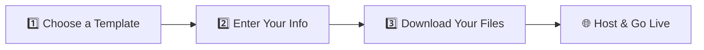

<div align="center">

# 💳 SmartCard
### Your Digital Business Card — One Download Away

**Free • No Account • No Lock-In • Own Your Files Forever**

[](https://opensource.org/licenses/MIT)


[🌐 Live Demo](https://smartcard-chi.vercel.app/) • [🎬 Video Tutorial](https://streamain.com/mh1UmrT1iwRXZpP/watch) • [📲 Download App](#-download-the-app)

</div>

---

## 🚀 Overview

**SmartCard** is a free, modern, and lightweight **digital business card generator** that helps creators, freelancers, businesses, and professionals build a beautiful online profile — in minutes.

No account required. No monthly fees. No lock-in.

Simply enter your information, add your social media links, upload your logo or profile picture, and instantly download a complete website package. Host it anywhere and keep **full ownership** of your files forever.

---

## 📲 Download the App

| Platform | Download |
|---|---|
| 🌐 Web App | [Launch SmartCard](https://smartcard-chi.vercel.app/) |
| 🤖 Android APK | [Download v2.0](https://github.com/preatomytofficial/Smart-Card/releases/tag/V2.0) |

---

## ✨ Key Features

<table>
<tr>
<td width="50%" valign="top">

### 🎨 Professional Digital Profile
Create a stunning personal profile page that showcases:
- Name & Username
- Bio
- Profile Picture & Brand Logo
- Social Media Links
- Website Links
- Contact Information

</td>
<td width="50%" valign="top">

### 🔗 All Your Links, One Place
Connect every platform:
- Facebook, Instagram, YouTube, TikTok
- Telegram, X (Twitter), LinkedIn
- WhatsApp, GitHub
- Portfolio & Custom Links

</td>
</tr>
<tr>
<td width="50%" valign="top">

### ⚡ Instant Setup
No coding required:
1. Choose a template
2. Enter your details
3. Download your website files

Ready in **under 2 minutes**.

</td>
<td width="50%" valign="top">

### 📦 Download & Own
Get your files, host anywhere:
```text
index.html
style.css
app.js
```
No subscriptions. No vendor lock-in.

</td>
</tr>
</table>

### 🆓 Free Forever
- ♾️ Unlimited Profiles
- ♾️ Unlimited Downloads
- ♾️ Unlimited Social Links
- 🚫 No Account Required
- 🚫 No Monthly Fees
- 🚫 No Hidden Charges

---

## 🎯 Who Is It For?

| 🎥 Content Creators | 💼 Freelancers | 🏢 Businesses | 🎓 Students |
|---|---|---|---|
| YouTubers | Designers | Local Businesses | Portfolios |
| TikTok Creators | Developers | Startups | Personal Branding |
| Instagram Influencers | Marketers | Agencies | Resume Websites |

---

## 🛠 How It Works



**Step 1 — Choose a Template**
Select from professionally designed templates optimized for mobile and desktop.

**Step 2 — Enter Your Information**
Add your name, username, bio, profile photo, logo, and social media accounts.

**Step 3 — Download Your Files**
Instantly receive `index.html`, `style.css`, and `app.js` — upload them anywhere and go live.

---

## 📱 Example Profile

```text
Alex Rivera
@alexrivera

Instagram   YouTube   TikTok   Website
```

Each button opens the linked profile in a new tab:

```javascript
window.open("https://instagram.com/alexrivera", "_blank");
```

---

## 🌐 Hosting Options

| Provider | Notes |
|---|---|
| **GitHub Pages** | Free static hosting |
| **Netlify** | Fast deployment + global CDN |
| **Vercel** | Perfect for creators & developers |
| **InfinityFree** | Completely free hosting |
| **Hostinger** | Custom domains + pro hosting |
| **cPanel / Local Server** | Full control |

---

## 💡 Roadmap — Coming Soon

- [ ] 📱 QR Code Generator
- [ ] 📶 NFC Smart Card Support
- [ ] 🎨 Multiple Themes + Dark Mode
- [ ] 📊 Analytics Dashboard
- [ ] 🌍 Custom Domains
- [ ] 🔍 SEO Optimization
- [ ] 👁️ Profile Visitor Tracking
- [ ] 📇 Downloadable Contact vCard
- [ ] 🗣️ Multi-Language Support

---

## 🔒 Privacy First

SmartCard respects your privacy:

✅ No account required &nbsp;•&nbsp; ✅ No personal data collection &nbsp;•&nbsp; ✅ No tracking &nbsp;•&nbsp; ✅ No subscriptions

**Your files remain yours — forever.**

---

## 📈 Why SmartCard?

Many digital card services charge monthly fees and lock your profile inside their platform. SmartCard is different:

✅ Download your files &nbsp;&nbsp; ✅ Host anywhere &nbsp;&nbsp; ✅ Keep full ownership
✅ Unlimited links &nbsp;&nbsp; ✅ No account needed &nbsp;&nbsp; ✅ Free forever

---

## 🎉 Get Started

<div align="center">

### SmartCard — Your Digital Business Card, One Download Away.

Create a stunning profile that connects all your social media, showcases your brand, and helps people find everything about you in one place.

**[🚀 Start Building Today →](https://smartcard-chi.vercel.app/)**

</div>

---

## 📄 License

MIT License — Free for personal and commercial use.

---

<div align="center">

**Created with ❤️ by [Preatom YT](https://www.youtube.com/@PreatomYTOfficial)**

Status: **Free Forever 🚀**

[YouTube](https://www.youtube.com/@PreatomYTOfficial) • [Facebook](https://www.facebook.com/preatomyt) • [Instagram](https://www.instagram.com/preatomyt/) • [X](https://x.com/Preatom_YT) • [Telegram](https://t.me/PreatomYT) • [GitHub](https://github.com/Preatomytofficial)

</div>
